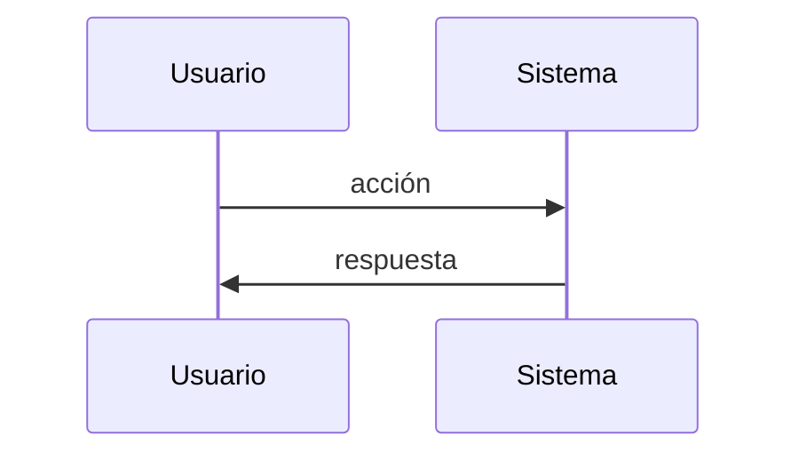

# Spec Funcional — {{PROJECT_NAME}}

> **Audiencia:** PMs, stakeholders, nuevos integrantes del equipo, anyone que necesite entender QUÉ hace este sistema y POR QUÉ.
> **Generada:** {{DATE}} via reverse-SDD
> **Leyenda:** `[INFERRED]` deducido del código · `[ASSUMPTION]` asunción a validar · `[CONFIRMED]` confirmado por el usuario

---

## 1. Propósito

Una o dos oraciones que respondan: ¿qué problema resuelve este sistema y para quién?

Si no se pudo inferir del código y no fue confirmado, escribí `[ASSUMPTION] El sistema parece resolver X para Y, basándome en Z evidencia.`

## 2. Usuarios y actores

Lista de los tipos de usuarios o sistemas que interactúan con esto. Para cada uno:

- **Nombre del rol** — qué hace en el sistema y por qué.

Ejemplo:
- **Cliente final** — crea órdenes, consulta estado de envío.
- **Operador interno** — revisa órdenes pendientes y aprueba devoluciones.
- **Sistema de pagos externo** — recibe webhooks de transacciones confirmadas.

## 3. Casos de uso principales

Cada caso de uso debe tener un nombre, una descripción de una línea, y los pasos clave del flujo (sin entrar en cómo está implementado).

### CU-01: {{Nombre del caso de uso}}

**Quién:** rol que lo ejecuta
**Qué:** descripción en una línea
**Flujo:**
1. Paso observable 1
2. Paso observable 2
3. Resultado

**Reglas asociadas:** referencia a las reglas de negocio que aplican (ver sección 4).

(Repetir por cada caso de uso identificado. Apuntá a 3-10 casos de uso principales — si hay más, agrupá por módulo.)

## 4. Reglas de negocio

Lista numerada de reglas que el sistema impone. Cada regla debe ser declarativa y verificable.

- **RN-01:** Una orden no puede crearse si algún ítem no tiene stock disponible.
- **RN-02:** Los descuentos solo aplican a clientes con más de 30 días de antigüedad.
- **RN-03:** ...

Si una regla está implícita en validaciones del código pero no documentada, marcala como `[INFERRED]`.

## 5. Flujos clave

Describí 2-4 flujos end-to-end importantes. Pueden incluir un diagrama Mermaid si aclara.

### Flujo: {{nombre}}

Descripción narrativa del flujo, paso a paso, desde el punto de vista del usuario o del sistema observable. No menciones nombres de funciones ni archivos.

## 6. Estados y transiciones

Si el dominio tiene entidades con estados (orden, usuario, ticket, etc.), documentá los estados posibles y las transiciones permitidas.

### Entidad: {{nombre}}

| Estado | Descripción | Transiciones permitidas |
|--------|-------------|--------------------------|
| `nuevo` | recién creada | → `confirmado`, `cancelado` |
| `confirmado` | validada y pagada | → `enviado`, `cancelado` |
| ... | ... | ... |

## 7. Out of scope

Qué cosas el sistema explícitamente NO hace, para evitar confusión.

- No gestiona inventario físico (lo delega a sistema externo X).
- No envía emails directamente (encola eventos para un servicio aparte).
- ...

## 8. Glosario de dominio

Términos del negocio que aparecen en el código y/o en esta spec. Definilos brevemente.

- **Orden:** ...
- **Tenant:** ...
- **SKU:** ...

## 9. Asunciones a validar

Lista consolidada de todos los `[ASSUMPTION]` marcados en la spec, para que el usuario los revise en un solo lugar.

- [ ] ASSUMPTION 1: ...
- [ ] ASSUMPTION 2: ...
