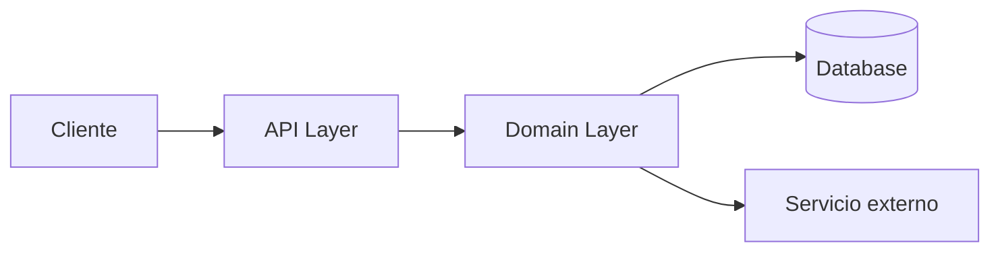

# Spec Técnica — {{PROJECT_NAME}}

> **Audiencia:** Desarrolladores que tienen que tocar este código.
> **Generada:** {{DATE}} via reverse-SDD
> **Leyenda:** `[INFERRED]` deducido del código · `[ASSUMPTION]` asunción a validar · `[CONFIRMED]` confirmado por el usuario

---

## 1. Resumen técnico

Dos o tres oraciones que digan: qué tipo de sistema es (API REST, CLI, worker, monolito, microservicio, librería, etc.), qué stack usa, y cómo corre.

## 2. Stack y versiones

| Componente | Tecnología | Versión | Notas |
|------------|------------|---------|-------|
| Lenguaje | | | |
| Runtime | | | |
| Framework principal | | | |
| Base de datos | | | |
| Cache | | | |
| Otros | | | |

Si no se pudo determinar la versión, marcá `[INFERRED]` y poné el rango probable.

## 3. Arquitectura

### 3.1 Estilo arquitectónico

Identificá el patrón general: monolito en capas, hexagonal, MVC, microservicios, event-driven, etc. Una a tres oraciones.

### 3.2 Estructura de carpetas

Mostrá el árbol de carpetas relevante (no todo, solo lo que importa para entender la arquitectura) y explicá brevemente para qué sirve cada una.

```
src/
├── api/          # handlers HTTP
├── domain/       # entidades y reglas de negocio
├── infra/        # repositorios, clientes externos
└── ...
```

### 3.3 Diagrama de componentes



## 4. Modelo de datos

### 4.1 Entidades principales

Para cada entidad relevante:

#### `Entidad`

- **Propósito:** una línea
- **Atributos clave:** lista corta
- **Relaciones:** con qué otras entidades se relaciona

### 4.2 Esquema (si hay BD relacional)

Resumen del esquema. No pegues el DDL completo a menos que sea muy chico. Mencioná tablas principales, índices importantes, constraints destacables.

### 4.3 Migraciones

¿Hay un sistema de migraciones? ¿Cuál? ¿Dónde viven?

## 5. Superficie de API

Si el sistema expone una API (HTTP, gRPC, CLI, eventos), documentá los endpoints principales.

### 5.1 Endpoints HTTP

| Método | Ruta | Propósito | Auth |
|--------|------|-----------|------|
| `POST` | `/orders` | Crear orden | Sí |
| `GET` | `/orders/{id}` | Consultar orden | Sí |
| ... | | | |

### 5.2 Autenticación / Autorización

Esquema usado (JWT, sessions, API keys, OAuth, etc.) y dónde está implementado.

### 5.3 Contratos / DTOs

Mencioná dónde viven los schemas/tipos de request/response. Si hay validación con una lib específica (Pydantic, Zod, class-validator, etc.), nombrala.

## 6. Dependencias externas

### 6.1 Servicios externos

Sistemas con los que el proyecto se comunica.

- **{{Servicio}}** — para qué se usa, cómo se consume (HTTP, SDK, cola).

### 6.2 Librerías críticas

No listes todas las dependencias del manifest — solo las que son arquitectónicamente importantes (ORM, framework HTTP, lib de auth, etc.).

## 7. Configuración

¿Cómo se configura el sistema? Variables de entorno, archivos, secretos. Mencioná los más importantes (no pegues secretos reales).

## 8. Decisiones técnicas y trade-offs

Lista breve estilo ADR (Architecture Decision Records). Para cada decisión detectable en el código:

### TD-01: {{Decisión}}

- **Contexto:** por qué se necesitaba decidir algo
- **Decisión:** qué se eligió
- **Trade-off:** qué se ganó y qué se perdió
- **Status:** `[INFERRED]` / `[CONFIRMED]`

Apuntá a 3-7 decisiones importantes. Si no podés inferir el "por qué" del código, dejalo como `[ASSUMPTION]` y apuntalo para validar.

## 9. Deployment y runtime

- **Cómo se buildea:** comando, herramienta
- **Cómo corre:** Docker, systemd, serverless, etc.
- **Dónde corre:** cloud, on-prem, local (si se puede inferir de configs/CI)
- **CI/CD:** ¿hay pipeline? ¿dónde está definido? (`.github/workflows`, `.gitlab-ci.yml`, etc.)

## 10. Observabilidad

- **Logging:** lib usada, formato (JSON estructurado, plain text), destino
- **Métricas:** ¿hay? ¿qué herramienta? (Prometheus, OpenTelemetry, etc.)
- **Tracing:** idem
- **Health checks:** endpoint o mecanismo

Si algo no existe, decilo: "No se detectó instrumentación de métricas."

## 11. Testing

- **Frameworks:** qué se usa para tests
- **Tipos de test presentes:** unit, integration, e2e
- **Cobertura observable:** alta / media / baja / sin tests
- **Cómo correr los tests:** comando

## 12. Gaps técnicos detectados

Cosas que mientras leías el código te llamaron la atención como deuda técnica, riesgo, o ausencia notable. Sé respetuoso pero honesto.

- ...

## 13. Asunciones a validar

Lista consolidada de todos los `[ASSUMPTION]` marcados en la spec.

- [ ] ASSUMPTION 1: ...
- [ ] ASSUMPTION 2: ...
